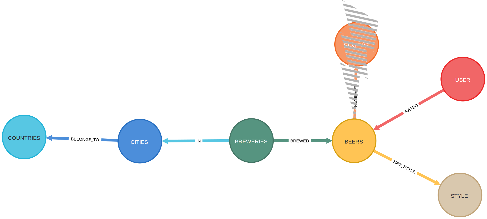
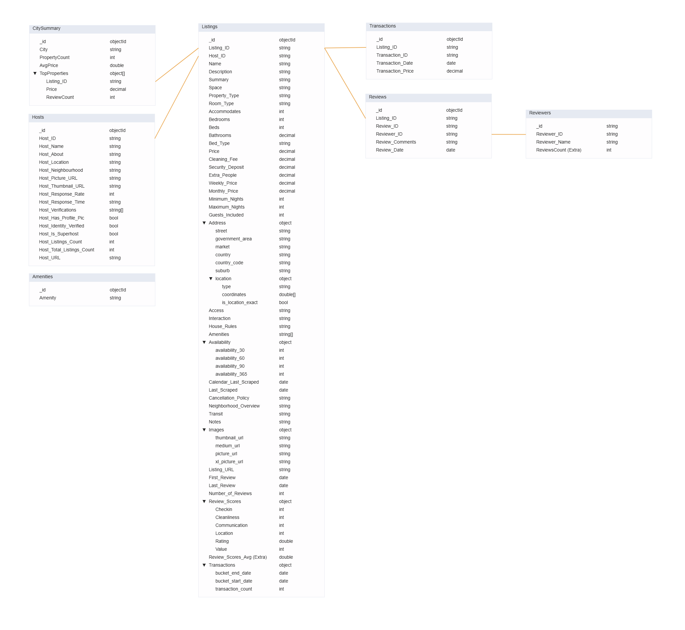

# **🗄️ Advanced Database Modeling: Neo4j & MongoDB 🚀**

    

## 📝 Description

This repository is a portfolio of advanced database modeling projects for the **Big Data Management and Modelling (BDMM)** course. It showcases the practical application of two powerful NoSQL database paradigms: **Graph Databases** using **Neo4j** (Assignment 1) and **Document Databases** with **MongoDB** (Assignment 2). Each assignment tackles a real-world business problem, demonstrating the entire lifecycle from data modeling and schema design to querying, optimization, and analysis.

## ✨ Objective

The core objectives of these projects were to:
*   Design, implement, and query a graph database to analyze highly connected data.
*   Apply various data modeling patterns (e.g., Subset, Bucket, Linking) to optimize a document database for specific use cases.
*   Perform data cleaning, schema refinement, and performance tuning (indexing) in both database systems.
*   Utilize Python database connectors (`neo4j`, `pymongo`) for programmatic interaction and analysis.

## 🎓 Project Context

This work was completed for the **Big Data Management and Modelling (BDMM)** course in the **[Master's in Data Science and Advanced Analytics](https://www.novaims.unl.pt/en/education/programs/postgraduate-programs-and-master-degree-programs/master-degree-program-in-data-science-and-advanced-analytics-with-a-specialization-in-data-science/)** program at **NOVA IMS**. The assignments were completed during the **2nd Semester, 1st Trimester** of the **2024/2025** academic year.

## 🛠️ Technologies Used

This portfolio demonstrates proficiency with the following database technologies and their Python ecosystems.

    
    
    
    
    

---

## 📚 Project Breakdown

### 1️⃣ [Assignment 1: The Beer Project 🍺 (Neo4j)](./Homework1_Neo4J_TheBeerProject/)

    
    
    

This assignment explores the use of **Neo4j**, a graph database, to analyze relationships within data about beers, breweries, and reviews. Graph databases provide a natural way to navigate and query highly connected information. The project utilizes a dataset based on [Evan Hallmark's Kaggle dataset](https://www.kaggle.com/ehallmar/beers-breweries-and-beer-reviews).

### 📰 Problem Description

Assume the role of a Data Management professional in an analytics company. Your task is to explore the provided Neo4j database using the Python `neo4j` connector and/or the Neo4j Browser tool. You need to answer specific analytical questions, requiring adjustments and cleaning of the database schema along the way. Document all changes made to the database.

### 🗺️ Final Database Schema

The following schema represents the structure of the graph database after cleaning and adjustments made during the assignment:

  

<i>Figure 1.1: Final Database Schema for the Beer Project</i>

 

### ❓ Questions Addressed

1.  **Database Exploration:** Familiarization with the initial schema, nodes, relationships, and properties. [1 point]
2.  **Schema Adjustment & Cleaning:** Identification and correction of errors, removal of redundancies, schema refinement with justification, and visualization of the final schema (as shown above). [4 points]
3.  **Biweekly Reporting Queries:** [5 points]
    *   a. Find the review count for the beer with the most reviews.
    *   b. Identify the top three users who wrote the most reviews.
    *   c. Find beers described with keywords: 'fruit', 'complex', 'nutty', 'dark'.
    *   d. Determine the top three breweries producing the widest variety of beer styles.
    *   e. Identify the country producing the most distinct beer styles.
4.  **Performance Optimization Queries:** Optimization for daily access/updates, using `PROFILE` to measure improvements. [4 points]
    *   a. Find the five strongest beers by ABV (handling errors like Snake Venom), displaying ABV and brewery.
    *   b. Find the top 5 distinct beer styles with the highest average (smell + feel) score, reviewed by the third most active user.
5.  **Graph Algorithm Queries (GDS):** Answer **two** using the Neo4j Graph Data Science library. [6 points]
    *   a. Determine the two most similar countries based on their top five most produced beer styles.
    *   b. Identify the most popular beer based on the number of unique reviewers.
    *   c. ~~Community detection based on review smell scores.~~
    *   d. ~~Identify the most influential user based on reviews of distinct beer styles.~~

*Detailed answers and code can be found in the [Homework1_Neo4J_TheBeerProject](./Homework1_Neo4J_TheBeerProject) directory.*

---

### 2️⃣ [Assignment 2: Airbnb Data Modeling 🏠 (MongoDB)](./Homework2_MongoDB/)

    
    

This assignment focuses on **MongoDB**, a NoSQL document database, and addresses data modeling challenges within the context of **[AirBNB](https://www.airbnb.com/)** listings data. The goal is to optimize the database schema for various business use cases, improve query performance, and handle data quality issues using appropriate MongoDB patterns and features.

### 📰 Problem Scenario & Challenges

You are part of a new Data Engineering team at AirBNB tasked with restructuring the database due to performance issues and data quality problems left by previous teams. Key challenges include:

*   **Large Documents:** Storing excessive listing information in single documents leads to slow queries.
*   **Lack of Patterns:** No data modeling patterns (e.g., embedding, linking, subset, bucket) were applied to optimize performance.
*   **Missing Indexes:** Inefficient querying due to the absence of indexes.
*   **Review Scalability:** Rapid growth in reviews requires a better storage strategy than simply overwriting.
*   **Data Errors:** Duplicate entries and incorrect timestamps need correction.

### 🎯 Key Tasks

Your role involves redesigning the database schema considering query usage frequency and read/write impacts. This includes:

1.  Streamlining data collection.
2.  Cleaning data and optimizing query returns.
3.  Applying MongoDB patterns (Embedding, Linking, Subset, Bucket, Polymorphic, etc.) to accelerate common queries.
4.  Ensuring data accuracy and relevance.
5.  Documenting transformations and pattern usage with clear reasoning and expected outcomes (e.g., improved query speed, reduced document size).
6.  Sharing the final, optimized data model schema.

### ✨ Final Data Model Schema Design

The following diagram illustrates the optimized MongoDB schema designed during this assignment, incorporating various modeling patterns:

  

<i>Figure 2.1: Optimized MongoDB Schema for AirBNB Data</i>

 

### ❓ Questions Addressed

**Data Cleanup and Schema Adjustments:** [9 points]

1.  Review and adjust the schema for the primary use case (displaying listing info to customers), optimizing for performance by potentially separating data (e.g., reviews, transactions) using appropriate patterns (like Subset or linking). Clean data errors.

**Standard Difficulty Queries:** [2 points each]

2.  Find three superhosts (>1 listing) whose properties accommodate >4 people.
3.  Identify the most common bed type in New York listings featuring waterfront and a dishwasher.
4.  Find the author of the longest review in New York.
5.  Calculate the largest and smallest difference between price and security deposit per number of guests accommodated.
6.  Determine the average stay duration (using `maximum_nights`) per property type per city, identifying cities with highest/lowest averages for each type.

**Advanced Difficulty & Optimization Queries:** [3 points each]

7.  Optimize for retrieving a list of all unique amenities for host setup (use case: frequent reads, infrequent updates). Implement and query.
8.  Optimize for displaying top 20 reviewers by review count and quickly querying review counts per reviewer ID/Name (use case: frequent updates/reads). Implement and query.
9.  Adapt the schema to easily calculate the average review score across all existing and potentially *new* metrics without query changes (Polymorphic Pattern likely). Implement and query for an example property.
10. Optimize for quickly calculating the average transaction value within a given time period for a specific property (Bucket Pattern might be useful).
11. Design and optimize for a summary webpage showing metrics for the top 10 cities (e.g., property counts/types, average prices) and details of the top 3 properties within each (Subset/Computed Pattern).

**Database Update Operations:** [2 points each]

12. Add a new property with a new host and common amenities to a top city, ensuring data consistency.
13. Add a new review from a top reviewer for the new property.
14. Add a new review metric ('x_factor') and verify the average score calculation query (from Q9) works correctly.

*Detailed implementations, transformations, justifications, and query results can be found in the [Homework2_MongoDB](./Homework2_MongoDB) directory.*

---

## 👥 Group 5 Members

*   Alexandre Gonçalves, 20240738
*   André Silvestre, 20240502
*   Filipa Pereira, 20240509
*   João Henriques, 20240499
*   Umeima Mahomed, 20240543
